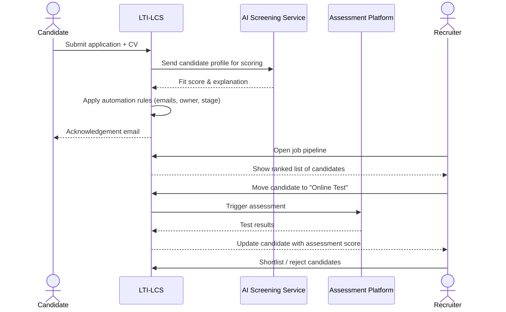
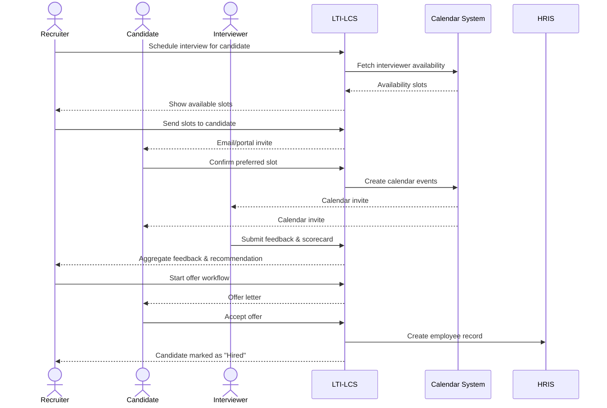
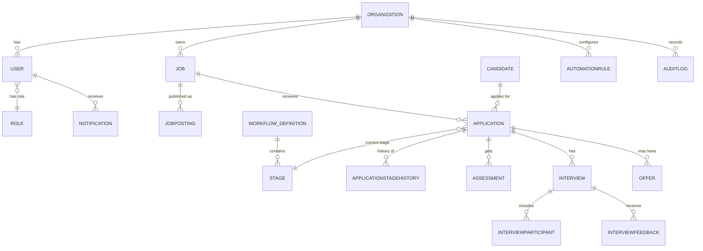
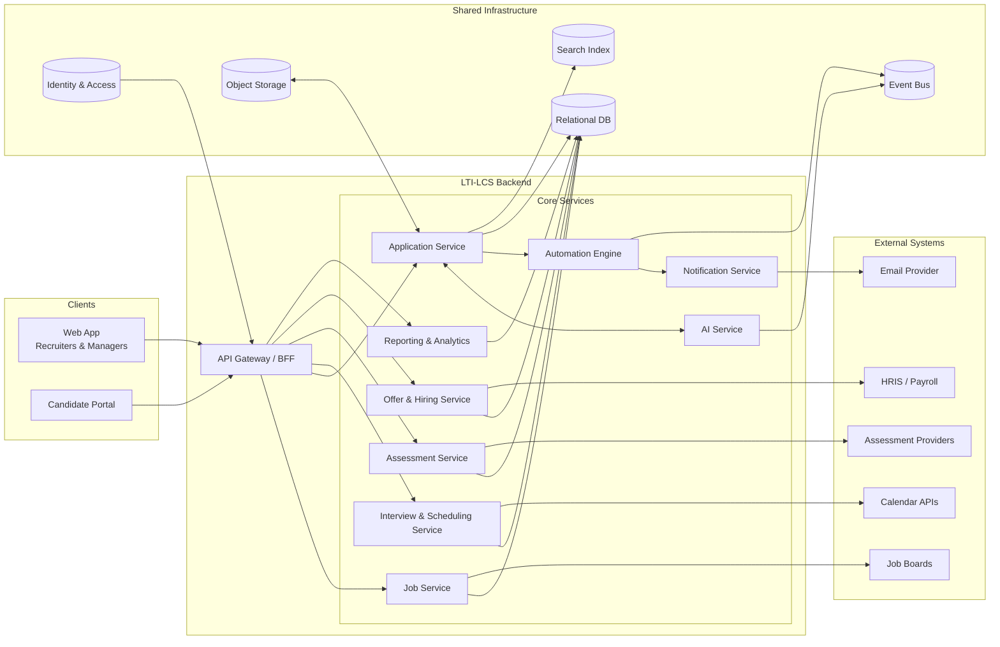
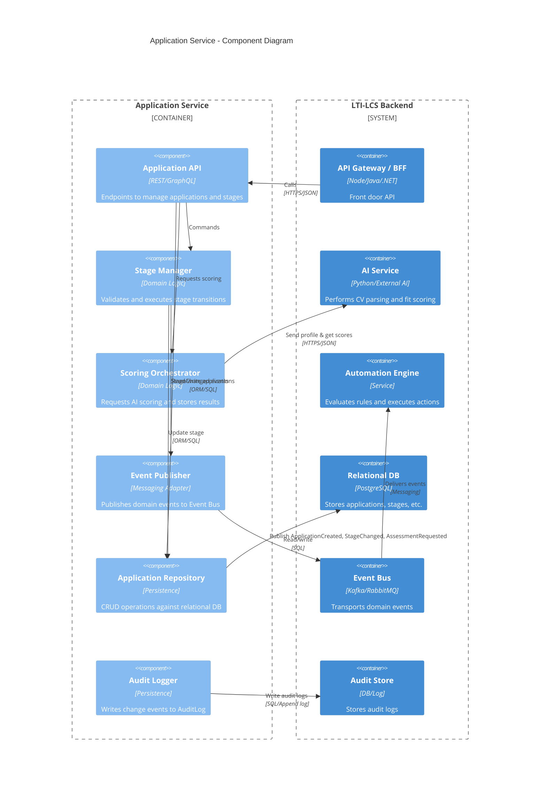

````markdown
# LTI-LCS – Applicant Tracking System  
_File name: `LTI-LCS.md`_

---

## 1. Research & Analysis

### 1.1. Problem Space

Modern recruitment usually suffers from:

- Manual, time-consuming tasks (posting jobs, screening CVs, scheduling interviews).
- Poor collaboration between HR, hiring managers, and external agencies.
- Fragmented tools (job boards, email, spreadsheets, HRIS) with little integration.
- Limited visibility on funnel metrics (time-to-hire, source effectiveness, diversity).
- Inconsistent candidate experience and communication.

The **LTI-LCS (Lean Talent Intelligence – Candidate Suite)** ATS is designed as an **end-to-end system** that covers the cycle shown in the reference image:

> Creating jobs → Publishing → Receiving applications → Reviewing → Online tests → Interviews → Hiring

while also providing:

- **Efficiency** for HR departments via automation.
- **Real-time collaboration** between recruiters, managers, and interviewers.
- **AI assistance** for repetitive and analytical tasks.
- **Data-driven insights** for continuous improvement.

### 1.2. Stakeholders & Personas

- **HR Manager / Recruiter**  
  Needs: manage multiple openings, maintain pipeline, ensure compliance, communicate with candidates.
- **Hiring Manager**  
  Needs: collaborate on job definition, quickly see shortlists, provide structured feedback.
- **Interviewer**  
  Needs: see schedule, candidate profiles, submit evaluations.
- **Candidate**  
  Needs: frictionless application, transparency, timely communication.
- **HR/IT Admin**  
  Needs: configure workflows, integrations, permissions, security.

### 1.3. Business Goals

- Reduce **time-to-hire** and **cost-per-hire**.
- Increase quality of hires through structured decision-making and consistent evaluation.
- Provide a delightful candidate experience (clear communication, self-service portal).
- Provide **clear analytics** to optimize sourcing channels and processes.
- Support **scalability** (from small companies to enterprise) and **compliance** (GDPR, audit trails).

### 1.4. Keys to Success

1. **End-to-end workflow orchestration**  
   Jobs, applications, tests, interviews, offers – every step represented as states and transitions.

2. **Strong collaboration model**  
   - Shared job dashboards.
   - Comment threads and @mentions on candidates and jobs.
   - Role-based access control.

3. **Automation engine**  
   - Triggers on events (application received, test completed, status changed).
   - Actions (email, update status, create task, notify manager, call webhooks).

4. **AI Assistance (opt-in, explainable)**  
   - CV parsing and profile enrichment.
   - Candidate-job fit scoring.
   - Suggested interview questions and email drafts.
   - Summaries of feedback and interviews.

5. **Integrations**  
   - Job boards, company website, LinkedIn, etc.
   - Calendar systems (Google / Microsoft 365).
   - HRIS / Payroll for hired candidates.
   - Online assessment platforms.

6. **Security, Compliance & Auditability**  
   - Permissions by role.
   - Data retention policies, candidate data export/delete.
   - Complete audit log of changes.

---

## 2. Brief Description, Added Value & Competitive Advantages

### 2.1. What is LTI-LCS?

**LTI-LCS** is a **cloud-based Applicant Tracking System** that manages the lifecycle from job creation to hiring:

- Central place to define jobs, publish them, collect applications.
- Unified pipeline view for each job.
- Built-in automation engine and AI assistant.
- Strong collaboration features and analytics.

### 2.2. Added Value

- **Single source of truth** for jobs, candidates, and hiring activity.
- **Time savings** via automation (auto-screening, notifications, scheduling).
- **Better hires** via structured evaluations, scorecards, and transparent history.
- **Improved candidate experience** via clear communication and self-service.
- **Actionable insights** via funnel analytics and source performance metrics.

### 2.3. Competitive Advantages

- **Automation-first**: A rules engine that non-technical HR users can configure.
- **AI-augmented, not AI-replacing**: AI suggestions are transparent, explainable, and always reviewable by humans.
- **Collaboration focused**: Inline comments, tags, and shared views for hiring teams.
- **API-centric architecture**: Easy integration with existing HR stack.
- **Configurable workflows**: Custom stages, templates, evaluation forms, and permissions.

---

## 3. Main Functions

1. **Job Management**
   - Create and approve job requisitions (role, salary range, location, hiring manager).
   - Define custom stages and scorecards per job.
   - Clone jobs and reuse templates.

2. **Job Publishing**
   - Push to company career site, job boards, and social channels.
   - Track which channels generate candidates.

3. **Candidate Portal**
   - Branded application forms with file uploads and questionnaires.
   - Candidate account to track status and update profile.

4. **Application Intake & Tracking**
   - Centralized pipelines per job (Kanban style).
   - Bulk actions: status updates, emailing, tagging, assigning owners.

5. **Screening & Shortlisting**
   - AI-assisted CV parsing and ranking.
   - Knock-out questions and eligibility rules.
   - Attachments, notes, tags, and scorecards.

6. **Assessments & Online Tests**
   - Native tests (MCQ, coding, personality) or external providers.
   - Store and visualize results per candidate and job.

7. **Interview Scheduling & Management**
   - Time-slot proposals using integrated calendars.
   - Automated reminders to candidates and interviewers.
   - Interview kits with questions and scorecards.

8. **Offers & Hiring**
   - Offer templates and approval workflows.
   - Offer letter generation and electronic acceptance.
   - Export to HRIS/Payroll once candidate is hired.

9. **Automation Engine**
   - “If event X and condition Y, then do Z”.
   - Example: When application is received, send confirmation email and assign recruiter.
   - Example: After test score < threshold, move candidate to “Rejected” and send polite email.

10. **AI Assistant**
    - Suggests screening questions, summary of profiles, and email drafts.
    - Provides insights like “top reasons for rejection this month”.

11. **Reporting & Analytics**
    - Time-to-hire, pipeline conversion, source effectiveness.
    - Diversity and inclusion metrics (if configured and compliant).

12. **Administration & Security**
    - User management, roles & permissions.
    - Data retention rules, export & delete requests.
    - Audit logs and configuration management.

---

## 4. Lean Canvas

### 4.1. Lean Canvas Table

| Block | Content |
| --- | --- |
| **Customer Segments** | HR teams in SMEs and mid-market companies; hiring managers; recruitment agencies; high-growth startups. |
| **Problem** | Manual and fragmented recruitment; slow response times; poor collaboration; lack of analytics; inconsistent candidate experience. |
| **Existing Alternatives** | Email + spreadsheets, generic ATS tools, job-board-only workflows. |
| **Unique Value Proposition** | “A collaborative, automation-first ATS that combines AI insights with human control to hire faster and better.” |
| **Solution** | End-to-end ATS with configurable workflows, automation rules, AI assistance, and rich collaboration features. |
| **Channels** | Direct sales, HR conferences, partnerships with HRIS vendors, online marketing. |
| **Revenue Streams** | SaaS subscription (per seat / per active job), add-ons for advanced AI and analytics, enterprise support. |
| **Cost Structure** | Cloud infrastructure, development, support, marketing, integration partnerships, compliance and security. |
| **Key Metrics** | Time-to-hire, number of hires per month, user activation and retention, automation adoption, NPS. |
| **Unfair Advantage** | Deep automation and AI features tightly integrated in workflow; strong APIs; customizable, yet opinionated best-practice templates. |

### 4.2. Lean Canvas Diagram (Mermaid)

```mermaid
flowchart LR
    subgraph P["Problem"]
        p1["Manual, fragmented recruitment"]
        p2["Slow, inconsistent processes"]
        p3["Lack of analytics & visibility"]
    end

    subgraph CS["Customer Segments"]
        cs1["HR Teams"]
        cs2["Hiring Managers"]
        cs3["Recruitment Agencies"]
        cs4["High-growth Startups"]
    end

    subgraph UVP["Unique Value Proposition"]
        u1["Automation-first ATS"]
        u2["AI-assisted, human-controlled"]
        u3["Collaborative hiring workspace"]
    end

    subgraph S["Solution"]
        s1["End-to-end workflows"]
        s2["Automation Engine"]
        s3["AI Screening & Insights"]
        s4["Analytics & Dashboards"]
    end

    subgraph K["Key Metrics"]
        k1["Time-to-hire"]
        k2["Conversion per stage"]
        k3["Source effectiveness"]
        k4["User adoption & retention"]
    end

    CS --> P
    P --> UVP
    UVP --> S
    S --> K
````

---

## 5. Use Cases

We highlight 3 main end-to-end use cases:

1. **UC1 – Create and Publish a Job**
2. **UC2 – Screen and Shortlist Applicants (with AI)**
3. **UC3 – Schedule Interviews and Hire Candidate**

### 5.1. UC1 – Create and Publish a Job

**Goal:** HR Manager defines a new job requisition and publishes it to selected channels.

**Primary Actor:** HR Manager
**Secondary Actors:** Hiring Manager, Job Board systems, Company Career Site.

**Preconditions:**

* HR Manager is authenticated and has “Job Owner” or “Recruiter” role.
* Organization has available job slots.

**Main Flow:**

1. HR Manager clicks “Create Job”.
2. Fills in job details, requirements, and hiring manager.
3. Selects workflow template (stages, scorecards).
4. Submits job for approval (optional).
5. Hiring Manager approves the job (if approval required).
6. System publishes job to:

   * Career site.
   * Selected job boards.
   * Social channels (optional).
7. System starts tracking applications for this job.

**Alternative Flows:**

* Approval not required → step 4 directly leads to publishing.
* Job is rejected → HR Manager receives comments and revises job.

**UC1 Diagram (Sequence)**

```mermaid
sequenceDiagram
    actor HR as HR Manager
    actor HM as Hiring Manager
    participant LTI as LTI-LCS
    participant JB as Job Boards
    participant CS as Career Site

    HR->>LTI: Create Job (title, description, requirements,...)
    LTI-->>HR: Show job workflow template options
    HR->>LTI: Select template & submit for approval
    LTI->>HM: Notify job pending approval
    HM->>LTI: Approve job
    LTI->>CS: Publish job
    LTI->>JB: Push job via integrations
    LTI-->>HR: Job published & pipeline created
```

---

### 5.2. UC2 – Screen and Shortlist Applicants (with AI)

**Goal:** Recruiter reviews incoming applications and creates a shortlist.

**Primary Actor:** Recruiter
**Secondary Actors:** AI Screening Service, Assessment Platform, Candidate.

**Preconditions:**

* Job is published and receiving applications.
* Automation rules and AI screening configuration are set.

**Main Flow:**

1. Candidate submits application through portal or job board.
2. System parses CV and questionnaire, stores application.
3. AI Screening Service evaluates candidate against job requirements, assigning a score.
4. Automation rules:

   * Send “Application received” email.
   * Assign recruiter and set initial stage “New”.
5. Recruiter opens job pipeline and sees ranked list of candidates.
6. Recruiter reviews AI recommendations, CVs, and questionnaires.
7. Recruiter:

   * Moves promising candidates to “Shortlisted”.
   * Triggers online tests for some candidates.
8. Assessment platform returns scores to LTI-LCS.
9. Recruiter updates statuses based on test results.

**Alternative Flows:**

* Candidate fails knock-out question → auto-rejected, email sent.
* AI scoring unavailable → candidates listed without ranking.

**UC2 Diagram (Sequence)**



---

### 5.3. UC3 – Schedule Interviews and Hire Candidate

**Goal:** Schedule interviews, collect feedback, issue offer, and mark candidate as hired.

**Primary Actor:** Recruiter
**Secondary Actors:** Candidate, Interviewers, Calendar System, HRIS.

**Preconditions:**

* Candidate is shortlisted.
* Interviewers and hiring manager are defined.

**Main Flow:**

1. Recruiter selects candidate and chooses “Schedule Interview”.
2. System displays interviewer availability based on connected calendars.
3. Recruiter selects time slots and sends invitations to candidate & interviewers.
4. Candidate confirms a slot (via portal) or proposes an alternative.
5. System updates calendar events and reminders.
6. After the interview, interviewers log into LTI-LCS to fill scorecards and comments.
7. System aggregates feedback and suggests a decision.
8. Hiring manager and recruiter decide to proceed with an offer.
9. System generates offer letter from template and submits for approval.
10. Candidate accepts the offer electronically.
11. System marks candidate as “Hired” and:

    * Closes job if all positions filled.
    * Exports candidate data to HRIS.

**Alternative Flows:**

* Candidate declines offer → status “Offer Declined”.
* Offer rejected in approval workflow → HR revises.

**UC3 Diagram (Sequence)**



---

## 6. Data Model

### 6.1. Key Entities & Attributes

**Notation:**

* Types are generic and can map to SQL types (e.g., `UUID`, `VARCHAR`, `TIMESTAMP`, `BOOLEAN`, `INT`).

1. **User**

   * `user_id : UUID`
   * `email : VARCHAR(255)`
   * `password_hash : VARCHAR(255)`
   * `first_name : VARCHAR(100)`
   * `last_name : VARCHAR(100)`
   * `role_id : UUID`
   * `organization_id : UUID`
   * `is_active : BOOLEAN`
   * `created_at : TIMESTAMP`
   * `updated_at : TIMESTAMP`

2. **Role**

   * `role_id : UUID`
   * `name : VARCHAR(50)` (e.g., Admin, Recruiter, HiringManager, Interviewer)
   * `permissions : JSONB`

3. **Organization**

   * `organization_id : UUID`
   * `name : VARCHAR(255)`
   * `domain : VARCHAR(255)`
   * `settings : JSONB`
   * `created_at : TIMESTAMP`

4. **Job**

   * `job_id : UUID`
   * `organization_id : UUID`
   * `title : VARCHAR(255)`
   * `department : VARCHAR(255)`
   * `location : VARCHAR(255)`
   * `employment_type : VARCHAR(50)` (Full-time, Part-time, Contract...)
   * `description_html : TEXT`
   * `requirements_html : TEXT`
   * `hiring_manager_id : UUID (User)`
   * `status : VARCHAR(50)` (Draft, Open, Paused, Closed)
   * `workflow_definition_id : UUID`
   * `created_at : TIMESTAMP`
   * `updated_at : TIMESTAMP`
   * `target_hires : INT`

5. **JobPosting**

   * `posting_id : UUID`
   * `job_id : UUID`
   * `channel : VARCHAR(50)` (CareerSite, LinkedIn, Indeed, etc.)
   * `external_reference : VARCHAR(255)` (ID at job board)
   * `url : VARCHAR(500)`
   * `published_at : TIMESTAMP`
   * `status : VARCHAR(50)` (Active, Expired)

6. **Candidate**

   * `candidate_id : UUID`
   * `first_name : VARCHAR(100)`
   * `last_name : VARCHAR(100)`
   * `email : VARCHAR(255)`
   * `phone : VARCHAR(50)`
   * `location : VARCHAR(255)`
   * `linkedin_url : VARCHAR(500)`
   * `resume_url : VARCHAR(500)`
   * `resume_text : TEXT`
   * `source : VARCHAR(100)` (Referral, Job Board, Direct, etc.)
   * `created_at : TIMESTAMP`
   * `updated_at : TIMESTAMP`
   * `consent_flags : JSONB`

7. **Application**

   * `application_id : UUID`
   * `candidate_id : UUID`
   * `job_id : UUID`
   * `current_stage_id : UUID`
   * `status : VARCHAR(50)` (New, InProcess, Rejected, Hired, Withdrawn)
   * `ai_fit_score : DECIMAL(5,2)`
   * `ai_fit_explanation : TEXT`
   * `applied_at : TIMESTAMP`
   * `last_action_at : TIMESTAMP`

8. **Stage (Workflow Stage)**

   * `stage_id : UUID`
   * `workflow_definition_id : UUID`
   * `name : VARCHAR(100)` (New, Screening, Interview, Offer, Hired, Rejected)
   * `order_index : INT`
   * `stage_type : VARCHAR(50)` (Screening, Interview, Assessment, Offer, Terminal)

9. **ApplicationStageHistory**

   * `history_id : UUID`
   * `application_id : UUID`
   * `from_stage_id : UUID`
   * `to_stage_id : UUID`
   * `changed_by_user_id : UUID`
   * `changed_at : TIMESTAMP`
   * `reason : VARCHAR(255)`

10. **Assessment**

    * `assessment_id : UUID`
    * `application_id : UUID`
    * `provider : VARCHAR(100)`
    * `type : VARCHAR(100)` (Technical, Cognitive, Personality...)
    * `status : VARCHAR(50)` (Pending, Completed, Failed)
    * `score : DECIMAL(5,2)`
    * `details : JSONB`
    * `completed_at : TIMESTAMP`

11. **Interview**

    * `interview_id : UUID`
    * `application_id : UUID`
    * `interview_type : VARCHAR(50)` (Phone, Onsite, Video...)
    * `scheduled_start : TIMESTAMP`
    * `scheduled_end : TIMESTAMP`
    * `location : VARCHAR(255)`
    * `status : VARCHAR(50)` (Scheduled, Completed, Cancelled)
    * `calendar_event_id : VARCHAR(255)`
    * `created_by_user_id : UUID`

12. **InterviewParticipant**

    * `interview_id : UUID`
    * `user_id : UUID` (interviewer)
    * `role : VARCHAR(50)` (Interviewer, Observer)

13. **InterviewFeedback**

    * `feedback_id : UUID`
    * `interview_id : UUID`
    * `user_id : UUID`
    * `overall_score : DECIMAL(5,2)`
    * `competency_scores : JSONB`
    * `comments : TEXT`
    * `recommendation : VARCHAR(50)` (StrongHire, Hire, NoHire, Undecided)
    * `submitted_at : TIMESTAMP`

14. **Offer**

    * `offer_id : UUID`
    * `application_id : UUID`
    * `status : VARCHAR(50)` (Draft, PendingApproval, Sent, Accepted, Declined)
    * `salary_amount : DECIMAL(12,2)`
    * `currency : VARCHAR(10)`
    * `start_date : DATE`
    * `offer_document_url : VARCHAR(500)`
    * `created_at : TIMESTAMP`
    * `updated_at : TIMESTAMP`

15. **AutomationRule**

    * `rule_id : UUID`
    * `organization_id : UUID`
    * `name : VARCHAR(255)`
    * `trigger : VARCHAR(100)` (ApplicationCreated, StageChanged, AssessmentCompleted...)
    * `conditions : JSONB`
    * `actions : JSONB`
    * `is_active : BOOLEAN`

16. **Notification**

    * `notification_id : UUID`
    * `user_id : UUID`
    * `type : VARCHAR(50)` (Email, InApp, Webhook)
    * `payload : JSONB`
    * `sent_at : TIMESTAMP`
    * `status : VARCHAR(50)` (Pending, Sent, Failed)

17. **AuditLog**

    * `audit_id : UUID`
    * `entity_type : VARCHAR(50)` (Job, Application, Candidate...)
    * `entity_id : UUID`
    * `changed_by_user_id : UUID`
    * `action : VARCHAR(50)` (Create, Update, Delete)
    * `before_data : JSONB`
    * `after_data : JSONB`
    * `changed_at : TIMESTAMP`

### 6.2. ER Diagram (Mermaid)



---

## 7. High-Level System Design

### 7.1. Architectural Overview

**Style:** Modular service-oriented architecture with an API gateway. Initial version could be implemented as a modular monolith that can later be decomposed.

**Layers / Components:**

1. **Client Applications**

   * Web App (Recruiters, Hiring Managers, Admins).
   * Candidate Portal (public UI for job search & applications).
   * Mobile / responsive web for interviewers.

2. **API Gateway / Backend for Frontend (BFF)**

   * Exposes REST/GraphQL endpoints.
   * Handles authentication, rate limiting, and request routing.

3. **Core Services**

   * **Job Service**: Job and workflow definitions.
   * **Application Service**: Candidate applications, stages, history.
   * **Interview & Scheduling Service**: Interviews, availability, calendar integration.
   * **Assessment Service**: Integrates external tests, stores results.
   * **Offer & Hiring Service**: Offer workflows, HRIS integration.
   * **Automation Engine**: Event bus listener, rule evaluation, action dispatcher.
   * **AI Service**: CV parsing, scoring, insights (can rely on external AI APIs).
   * **Notification Service**: Email, in-app, webhooks.
   * **Reporting & Analytics Service**: Aggregates metrics; may use data warehouse.

4. **Shared Infrastructure**

   * **Relational Database** (e.g., PostgreSQL) for transactional data.
   * **Search Index** (e.g., Elasticsearch/OpenSearch) for candidate and job search.
   * **Object Storage** (e.g., S3) for resumes and attachments.
   * **Message Broker / Event Bus** (e.g., Kafka / RabbitMQ) for decoupled events.
   * **Identity & Access Management** (JWT, OAuth2, SSO).

5. **External Integrations**

   * Job boards (via APIs).
   * Calendar systems (Microsoft 365 / Google).
   * Email service providers.
   * HRIS and payroll systems.
   * Assessment providers.

### 7.2. High-Level System Diagram (Mermaid)



---

## 8. C4 Diagram – Application Service (Component Level)

We go deeper into the **Application Service**, which manages applications, stages, and interaction with AI and automation.

### 8.1. Scope

* **Context:** Part of LTI-LCS backend.
* **Responsibilities:**

  * Manage CRUD for applications.
  * Enforce workflow rules for stage transitions.
  * Publish events (ApplicationCreated, StageChanged, AssessmentRequested).
  * Interact with AI Service for scoring.
  * Audit changes and expose APIs.

### 8.2. C4 Component Diagram (Mermaid)



---

## 9. Summary

This document defined the **LTI-LCS** ATS through:

* Market **research & analysis** and keys to success.
* A clear value proposition and main functions.
* A **Lean Canvas** for the business model.
* Three primary **use cases** with sequence diagrams.
* A detailed **data model** and ER diagram.
* A **high-level system design** with modular services and integrations.
* A **C4 component diagram** focusing on the Application Service.

This provides a solid foundation for the first implementation iteration and for aligning product, engineering, and business stakeholders on the scope and architecture of LTI-LCS.

```
```
